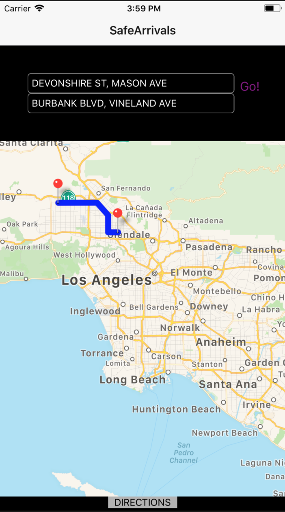
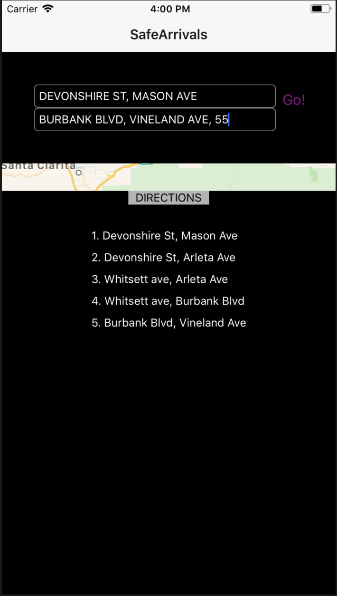
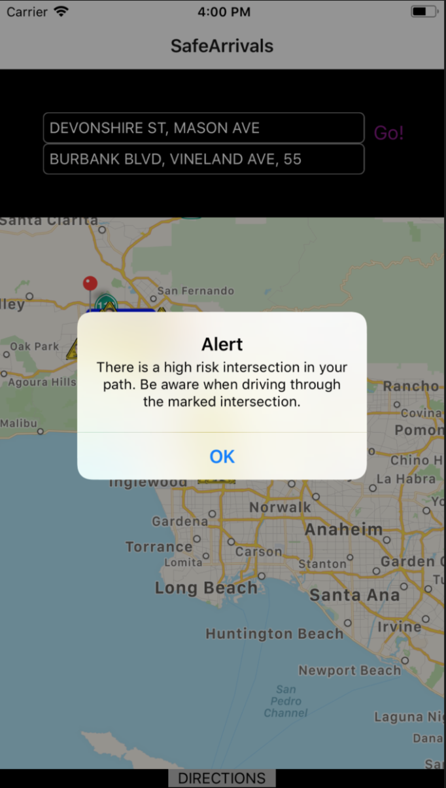
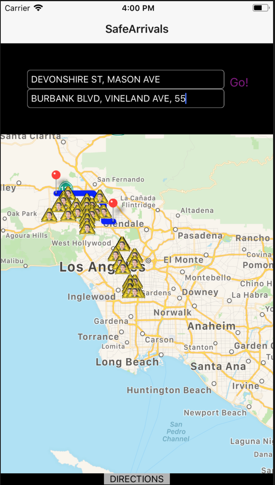

# Safe-Arrivals
2XB3 Project
## To Do
- [x] Parse Data from CSV To obtain locations with many collisions.
- [x] Sort Data and set threshold for marker to appear on map
- [x] Initialize Google maps using react-native-maps
- [x] Add markers to areas that exceed collision threshold
- [x] Navigation/Rerouting
- [x] Host app on cloud server.

## Project

Normal Routing:

Directions:

Alert if there are high amounts of collisions:

Routing with high collision areas:

